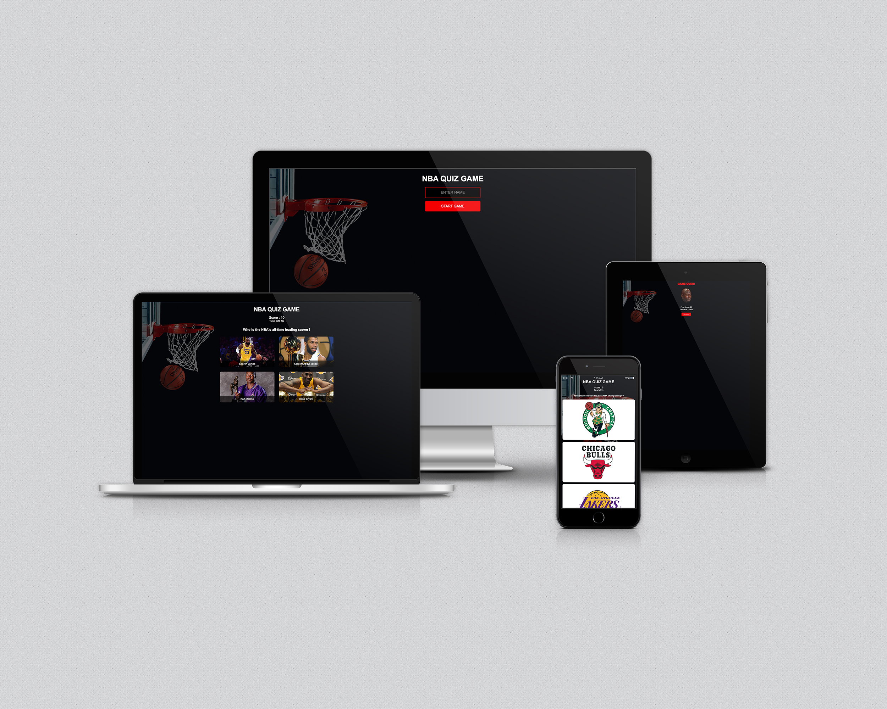
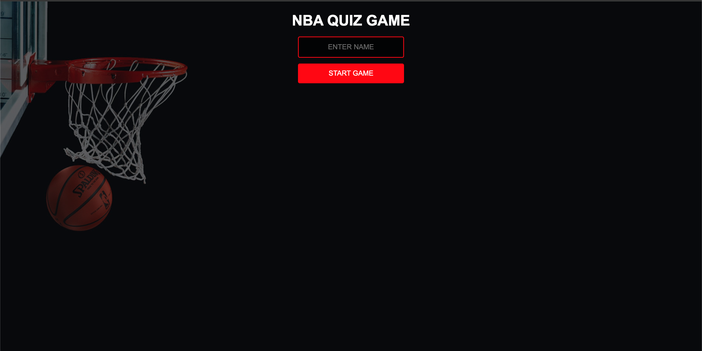
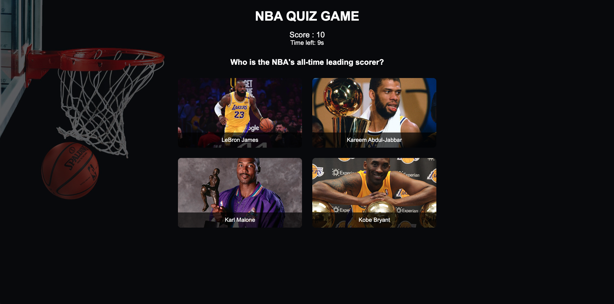
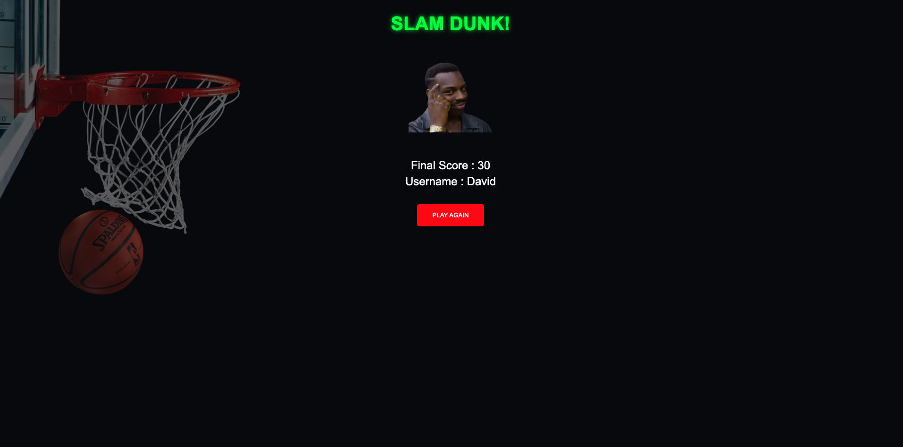
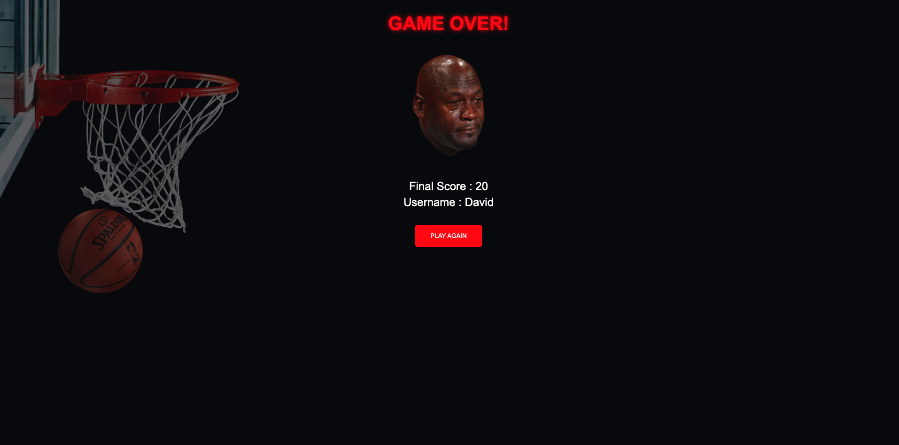
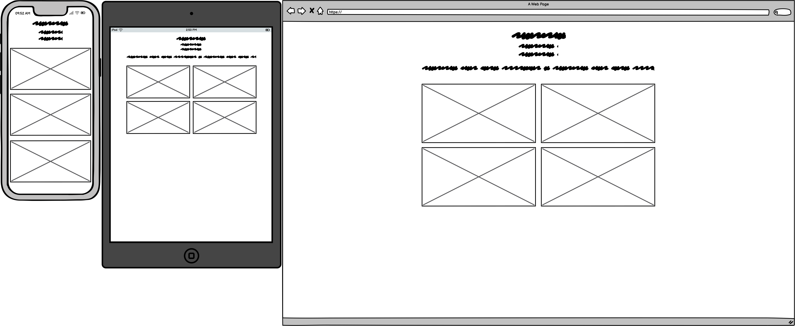
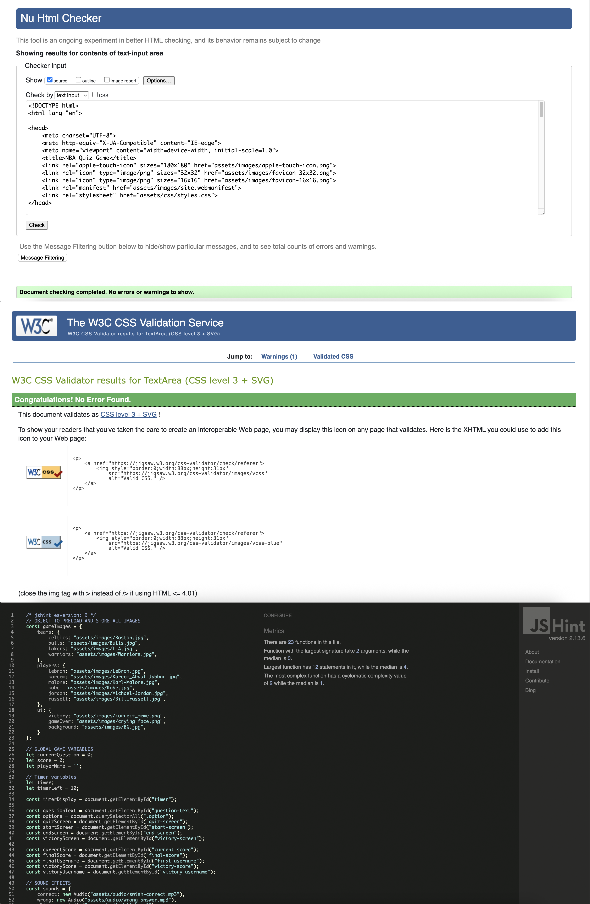
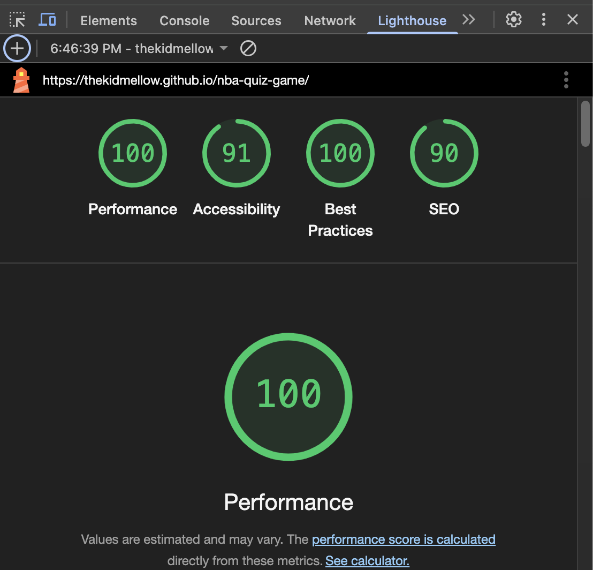

# 🏀 NBA QUIZ GAME

An engaging online quiz game to test your NBA knowledge! Challenge yourself with questions about NBA teams and players while enjoying a smooth, interactive experience with images, sound effects, and score tracking.

---

## 🎯 Table of Contents
- [Mockup](#mockup)

- [Wireframe](#wireframe)

- [Overview](#overview)

- [Features](#features)

- [Usage](#usage)

- [File Structure](#file-structure)

- [Technologies Used](#technologies-used)

- [Fonts Used](#fonts-used)

- [Color Scheme](#color-scheme)

- [Media](#media)

- [Validation](#validation)

- [Deployment](#deployment)

- [Future Improvements](#future-improvements)

---

## 🖼️ Mockup 

---

## 🖾 Wireframe

---

## 📝 Overview

NBA QUIZ GAME is a web-based interactive quiz designed to entertain users and test their knowledge about the NBA. It features:

- Multiple-choice questions with images

- Score tracking and timer per question

- Username input and personalized end screens

- Sound effects for feedback

- Responsive design for various devices

---

## 📋 Features

- **Start Screen** with player name input

- **Quiz Screen** with timed questions and answer options supported by images

- **Real-time Score Display**

- **Timer per question** (10 seconds)

- **Feedback on answer** (correct/incorrect highlight with sounds)

- **End Screen** showing final score and username

- **Victory Screen** for perfect scores

- Responsive and accessible UI with keyboard focus styles

- Image preloading with a loading screen

- Error handling for missing images (fallback placeholder)

- Play Again functionality to restart the game

## ⚙️ Usage

1. Open the game in a browser.

2. Enter your player name (max 20 characters).

3. Click **Start Game**

4. Answer the multiple-choice NBA questions before the timer runs out.

5. View your score either the Game Over or Victory screen.

6. Click **Play Again** to restart.

## 🕸️ File Structure

<pre>
nba-quiz-game/
│
├── assets/
│   ├── audio/
│   │   ├── click.mp3
│   │   ├── game-over.mp3
│   │   ├── swish-correct.mp3
│   │   ├── victory.mp3
│   │   └── wrong-answer.mp3
│   ├── css/
│   │   └── styles.css
│   ├── images/
│   │   ├── android-chrome-192x192.png
│   │   ├── android-chrome-512x512.png
│   │   ├── apple-touch-icon.png
│   │   ├── BG.jpg
│   │   ├── Bill_russell.jpg
│   │   ├── Boston.jpg
│   │   ├── Bulls.jpg
│   │   ├── correct_meme.png
│   │   ├── crying_face.png
│   │   ├── favicon-16x16.png
│   │   ├── favicon-32x32.png
│   │   ├── favicon.ico
│   │   ├── Kareem_Abdul-Jabbar.jpg
│   │   ├── Karl-Malone.jpg
│   │   ├── Kobe.jpg
│   │   ├── L.A.jpg
│   │   ├── LeBron.jpg
│   │   ├── Michael-Jordan.jpg
│   │   ├── nba-qg-logo.png
│   │   ├── nba-quiz-game-mockup.jpg
│   │   ├── nba-quiz-game-wireframe.png
│   │   ├── placeholder.jpg
│   │   ├── site.webmanifest
│   │   ├── victory-screen.png
│   │   └── Warriors.jpg
│   └── js/
│       └── script.js
│
├── index.html
└── README.md
</pre>

---

## 🦾 Validation

#### HTML [Tested and passed with no errors](https://validator.w3.org/nu/#textarea)

#### CSS [Tested and passed with no errors](https://jigsaw.w3.org/css-validator/validator)

#### JavaScript tested and passed with no errors

#### Lighthouse check

---

## 🛠️ Technologies Used

* HTML5 - Semantic markup

* CSS3 - Responsive styling and layout

* JavaScript (ES6+) - Game logic, timer, user interaction

* Audio API - Sound effects

* Image preloading and error handling

---

## ✍ Font Used

* `Arial, sans-serif`

---

## 🎨 Color Scheme

Color | Hex Code | Usage
--- | --- | ---
🟥 Red | #ff0000 | Buttons & Gameover Heading
🟩 Lime | #00ff00 | Victory Heading
⬜️ White | #FFFFFF | Paragraphs

## 🔈 Media

* Photos from [Google Images](https://google.com)

* Audio from [Voicemod Tuna](https://tuna.voicemod.net/)

----

## 🎛️ Deployment

### GitHub Pages

The site was deployed to [GitHub Pages](https://thekidmellow.github.io/nba-quiz-game/). The steps to deploy are as follows:

* In the GitHub repository, navigate to the "Settings" tab.

* In Settings, click on the "Pages" link from the menu on the left.

* From the "Build and deployment" section, click the drop-down called "Branch", and select the main branch, then click "Save".

* The page will be automatically refreshed with a detailed message display to indicate the successful deployment.

* Allow up to 5 minutes for the site to fully deploy.

* The live link can be found on [GitHub Pages](https://thekidmellow.github.io/nba-quiz-game/).

---

## Future Improvements

* Add more questions or categories (movies, sports, literature)

* Add user authentication and leaderboard system

* Save high scores using local storage or backend integration

* Enhance accessibility and keyboard navigation

* Add more animations and visual feedback

* Mobile app version or Progressive Web App (PWA) support

